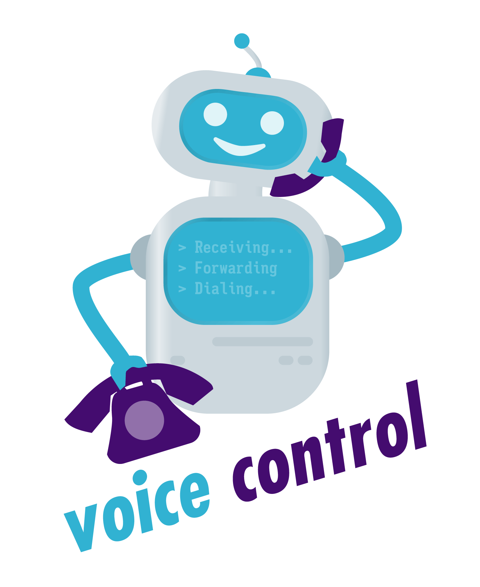

# voice control
Super flexible, custom voice mail and call routing for Twilio 
controlled by a Telegram bot control interface.

  

## Features
* Routing of incoming calls based upon a flexible, wildcard enabled routing table
* Voicemail 
    * Transcription of voicemail messages using Google speech to text
    * Recordings are delivered using a Telegram bot
* Voicemail and routing are controlled through a Telegram bot
* Supports multiple inbound/outbound numbers

## Inbound Call Routing

Inbound calls are routed based upon a routing table stored in MongoDB. 
If none of the rules match then the defaults, set in the 
application.properties file are used. 

### Routing Table Structure

The routing table for inbound calls, has the following structure:

| From    | To | Action  | Destination   | Priority |
|---------|----|---------|---------------|----------|
| +43*    | *  | FORWARD | +43123412345  | 100      |
| +49676* | *  | REJECT  |               | 90       |
| +44     | +1 | FORWARD | +431268686868 | 80       |

The wildcards * and ? are matched in the From and To fields. 
Priority is used to order the routing table entries, where a higher priority
means that this entry will be tested and matched first. 

This also means that entries which are more specific will be shadowed by 
less specific entries. 

In the following example the second rule will never be applied, since the
first routing rule already matches. 

| From    | To | Action  | Destination   | Priority |
|---------|----|---------|---------------|----------|
| +43*    | *  | FORWARD | +43123412345  | 100      |
| +43123* | *  | REJECT  |               | 90       |
| +44     | +1 | FORWARD | +431268686868 | 80       |

Therefore more specific rules need to have a higher priority then less 
specific rules. 